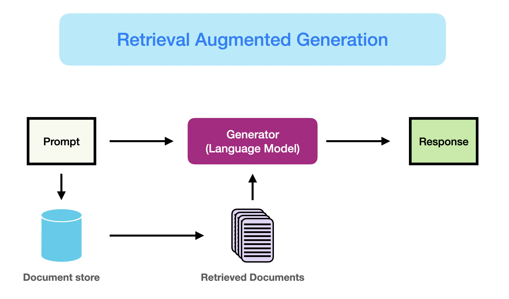
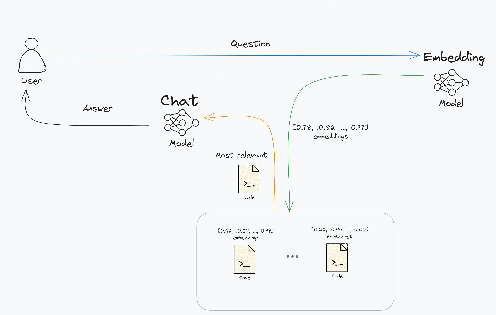
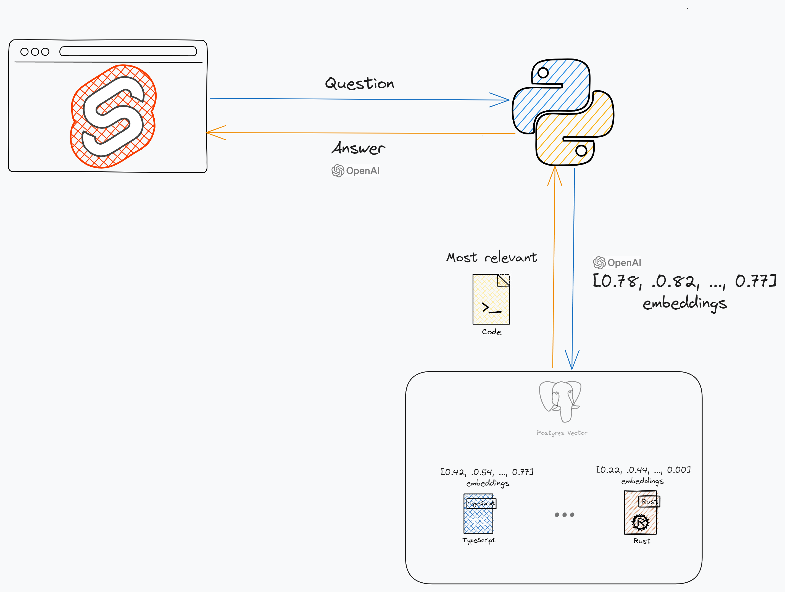

# Overview

> **Question** 🧑🏿‍💻: What is the purpose of this project? 

> **TalkingCode** 🤖: As a machine learning engineer and web developer, my GitHub repositories showcase my academic and personal projects, highlighting my skills in areas such as web development, machine learning, and data science. While my very advanced projects are not open-source, the repositories available offer a glimpse into my coding capabilities and project involvement. 

## ... RAG what?

TalkingCode is a retrieval augmented generation (RAG) chatbot that has access to all of my [GitHub repositories](https://github.com/ChidiRnweke). In case you're unfamiliar with RAG chatbots, the basic idea is that you summarize each of the code files in your repository into one or more lists of numbers, also known as embeddings. When a user sends a message to the chatbot, the message is also summarized into an embedding. These embeddings are then compared to find the most similar embeddings. The original code files are then appended to the original question as additional context. The chatbot then generates a response based on the context. The response is generated using a language model. The chatbot is able to generate responses that are relevant to the user's message.

## The components of the project

The project exists out of 3 components:

1. A data pipeline that embeds the code files in my GitHub repositories.
2. A backend that provides an API to the chatbot.
3. A frontend that provides a user interface to the chatbot.

The first two components are written in Python using respectively the Dagster and FastAPI frameworks. The frontend is written in TypeScript using sveltekit and TailwindCSS.

Each of these components has its own section in the documentation. The documentation is structured in such a way that you can pick up any of the components and read that section without needing to read the other sections. You can also read the documentation from start to finish to get a full understanding of the project.

Currently, the project uses OpenAI's `text-embedding-large` and `gpt-4o` for respectively the embeddings and the completions model. The embeddings are stored in a postgres database with the vector extension. A more detailed overview is the image below.

## Contributing

Contributions are welcome! At this point what I need the most is feedback on the project. If you have any feedback, please open an issue. Suggestions for new features are also welcome. If you want to contribute code, please open an issue first so we can discuss the feature or bug fix you want to work on.